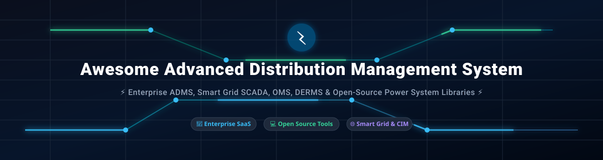

  

  
  
  
  
  

# ⚡ Top Advanced Distribution Management System (ADMS) Ecosystem

> **A Curated List of Enterprise SaaS Platforms & Open-Source GitHub Projects**  
> *Focused on Electric Distribution Grid Operations, Outage Management Systems (OMS), Distribution Management Systems (DMS), DER Integration, Network Analysis, SCADA Convergence & Utility Control Room Software.*

---

## 📑 Table of Contents
- [🌐 Overview & Ecosystem](#-overview--ecosystem)
- [🏢 Enterprise SaaS & Commercial ADMS Platforms](#-enterprise-saas--commercial-adms-platforms)
- [💻 Open-Source Repositories & Libraries](#-open-source-repositories--libraries)
- [📈 Star History](#-star-history)
- [🤝 How to Contribute](#-how-to-contribute)
- [💖 Support & Community](#-support--community)
- [📜 Disclaimer](#-disclaimer)

---

## 🌐 Overview & Ecosystem

An **Advanced Distribution Management System (ADMS)** is the operational core of modern electric utilities. It integrates real-time Supervisory Control and Data Acquisition (**SCADA**), Outage Management Systems (**OMS**), Distribution Management Systems (**DMS**), and Distributed Energy Resource Management Systems (**DERMS**) into a unified control room platform.

Key capabilities include:
- ⚡ **Real-time Grid Monitoring & Volt/VAR Optimization (VVO)**
- 🔌 **Fault Location, Isolation, and Service Restoration (FLISR)**
- ☀️ **Distributed Energy Resource (DER) Integration & Edge Control**
- 🗺️ **GIS & Network Model Management (IEC 61968 CIM Standard)**

---

## 🏢 Enterprise SaaS & Commercial ADMS Platforms

📊 **Sector Market Size & Dynamics:**  
The global Advanced Distribution Management System (ADMS) market is estimated at **$3.6 Billion to $4.8 Billion (2025–2026)** and is projected to reach **$8.5+ Billion by 2032** (CAGR ~13.5%). The sector is **highly concentrated**, dominated by a consolidated oligopoly of global industrial automation and energy tech giants (Siemens, Oracle, Schneider Electric, GE Vernova, Hitachi Energy) due to critical control room security requirements, mission-critical utility regulations, and high capital barriers to entry.

| Platform / Vendor | Description | Company Size (Revenue / Valuation) 🔻 | Starting Pricing Tier | Free Tier Limit / Trial Access |
| :--- | :--- | :--- | :--- | :--- |
| **[Siemens Spectrum Power ADMS](https://www.siemens.com/)** | Unified utility control platform providing SCADA, OMS, DMS, FLISR, and distribution power flow for large utility networks. | **~$80 Billion** (€75B+ Annual Revenue / ~$140B Market Cap) | ~$250,000+ base utility control license starting tier | No free tier; 30-day interactive simulation demo sandbox available on enterprise request |
| **[Oracle Utilities ADMS / NMS](https://www.oracle.com/utilities/)** | Comprehensive enterprise network management and outage prediction suite integrated with Oracle Utilities customer data platforms. | **~$53 Billion** (Annual Revenue / ~$380B Market Cap) | ~$200,000+ base enterprise deployment project starting tier | No free tier; guided cloud demonstration sandbox provided upon utility sales qualification |
| **[Schneider Electric EcoStruxure ADMS](https://www.se.com/)** | Industry-leading modular ADMS platform offering peak load management, FLISR, VVO, and grid digital twin analytics. | **~$40 Billion** (€36B+ Annual Revenue / ~$90B Market Cap) | ~$180,000+ annual base utility software subscription | No free public tier; custom pilot test environment provided for qualified electric utility tenders |
| **[GE Vernova GridOS ADMS](https://www.gevernova.com/)** | Next-generation microservices-based grid software platform designed for high DER penetration and real-time control room operations. | **~$38 Billion** (Annual Revenue / ~$50B Market Cap) | ~$150,000+ initial enterprise deployment base price | No free tier; 30-day virtual proof-of-concept (PoC) sandbox upon enterprise contact |
| **[Hitachi Energy ADMS](https://www.hitachienergy.com/)** | Integrated grid control systems featuring network analysis, outage handling, and substation automation for distribution utilities. | **~$15 Billion** (Energy Segment Revenue) | ~$120,000+ enterprise starting license quote | No free tier; demonstration environment provided via commercial inquiry |
| **[Hexagon ADMS](https://hexagon.com/)** | Geospatial-centric distribution management system integrating real-time GIS mapping with outage and SCADA workflows. | **~$5.5 Billion** (Annual Revenue) | ~$90,000+ base regional utility starting tier | No free tier; 14-day guided portal sandbox available upon utility request |
| **[ETAP ADMS / Power System](https://etap.com/)** | Model-driven distribution grid operational software providing real-time state estimation and outage mitigation. | **~$300 Million** (Annual Revenue - Schneider Subsidiary) | ~$25,000+ per workstation / annual server seat starting price | 14-day full feature free evaluation trial |
| **[SurvalentONE ADMS](https://www.survalent.com/)** | Fully integrated SCADA, OMS, and DMS platform built specifically for small to mid-sized electric cooperatives and municipal utilities. | **~$35 Million** (Estimated Annual Revenue) | ~$35,000+ base municipal utility package | No free public tier; 30-day interactive demo portal on request |
| **[Milsoft DisSPatch ADMS](https://www.milsoft.com/)** | Outage management and distribution analysis solution engineered for rural electric cooperatives and public power providers. | **~$20 Million** (Estimated Annual Revenue) | ~$15,000+ starting license fee for small utility feeders | No free tier; live online system demonstration on request |

---

## 💻 Open-Source Repositories & Libraries

While live utility control rooms rely on commercial platforms, open-source projects provide indispensable foundations for power system analysis, academic research, grid co-simulation, and ADMS application development.

*Repositories below are sorted by GitHub Star Count (Descending).*

### 1. 🐍 [PyPSA](https://github.com/PyPSA/PyPSA) 
- **Description:** Python for Power System Analysis (PyPSA) is a free software toolbox for simulating and optimizing modern energy systems, including power flow, optimal power flow (OPF), and multi-period capacity expansion.
- **Tech Stack:** Python, SciPy, Pyomo, Linopy
- **Primary Use Case:** Renewable integration, transmission/distribution co-optimization.

### 2. 🐼 [pandapower](https://github.com/e2nIEE/pandapower) 
- **Description:** An easy-to-use open-source power system modeling, analysis, and optimization program based on pandas and PYPOWER. Supports balanced/unbalanced load flow, state estimation, and short circuit calculation.
- **Tech Stack:** Python, Pandas, PYPOWER
- **Primary Use Case:** Distribution system planning, state estimation, and load flow analysis.

### 3. 📐 [MATPOWER](https://github.com/MATPOWER/matpower) 
- **Description:** A MATLAB/Octave package for power flow and optimal power flow (OPF) simulation, widely considered the gold standard benchmark in power system academic research.
- **Tech Stack:** MATLAB, Octave
- **Primary Use Case:** AC/DC Optimal Power Flow algorithms and research prototyping.

### 4. ⚡ [PowerModels.jl](https://github.com/lanl-ansi/PowerModels.jl) 
- **Description:** A Julia package designed for steady-state power network optimization. Provides decoupled formulations for AC, DC, and relaxed SOC/SDP power flow problems.
- **Tech Stack:** Julia, JuMP
- **Primary Use Case:** High-performance mathematical optimization of power grids.

### 5. 🔌 [PYPOWER](https://github.com/rwl/PYPOWER) 
- **Description:** Python port of MATPOWER for solving power flow and optimal power flow problems.
- **Tech Stack:** Python, NumPy, SciPy
- **Primary Use Case:** Lightweight power flow calculations in Python workflows.

### 6. 🌐 [ANDES](https://github.com/CURENT/andes) 
- **Description:** A Python-based power system dynamic simulation tool with symbolic modeling and transient stability analysis capabilities.
- **Tech Stack:** Python, SymPy, Numba
- **Primary Use Case:** Power system dynamics, transient simulation, and control modeling.

### 7. 📡 [opendnp3](https://github.com/dnp3/opendnp3) 
- **Description:** The reference open-source implementation of the Distributed Network Protocol (DNP3) standard used extensively in SCADA and utility automation systems.
- **Tech Stack:** C++, Java, C#
- **Primary Use Case:** Substation SCADA protocol implementation and telemetry integration.

### 8. 📊 [Power Grid Model](https://github.com/PowerGridModel/power-grid-model) 
- **Description:** An LF Energy project built for high-performance steady-state distribution power system calculations, optimized for processing massive numbers of smart meter data feeds.
- **Tech Stack:** C++, Python
- **Primary Use Case:** High-throughput distribution load flow and voltage state estimation.

### 9. 🔬 [GridLAB-D](https://github.com/gridlab-d/gridlab-d) 
- **Description:** Open-source agent-based distribution simulation tool developed by US DOE / PNNL. Models end-use loads, distributed generation, and detailed feeder dynamics.
- **Tech Stack:** C, C++, Python
- **Primary Use Case:** Smart grid agent simulation, DER impact studies, and tariff design.

### 10. 🛠️ [PowSyBl Core](https://github.com/powsybl/powsybl-core) 
- **Description:** Power System Blocks Library (LF Energy) providing high-performance grid modeling, CGMES format parsing, and modular simulation APIs.
- **Tech Stack:** Java, C++
- **Primary Use Case:** Grid operator platform development and standard CIM data exchange.

### 11. 🔄 [HELICS](https://github.com/GMLC-TDC/HELICS) 
- **Description:** Hierarchical Engine for Large-scale Infrastructure Co-Simulation (US DOE), cross-linking transmission, distribution, and communications simulators.
- **Tech Stack:** C++, Python, Java, Julia
- **Primary Use Case:** Co-simulation of power grids with telecommunications and market software.

### 12. 🌿 [PowerModelsDistribution.jl](https://github.com/lanl-ansi/PowerModelsDistribution.jl) 
- **Description:** Extension of PowerModels.jl focused on multi-phase unbalanced distribution network optimization and feeder reconfiguration.
- **Tech Stack:** Julia, JuMP
- **Primary Use Case:** Unbalanced distribution feeder optimal power flow.

### 13. ⚡ [OpenDSS Engine](https://github.com/tshort/OpenDSS) 
- **Description:** Electric Power Research Institute (EPRI) Open Distribution System Simulator engine for multi-phase distribution network analysis and harmonic study.
- **Tech Stack:** Object Pascal, C++
- **Primary Use Case:** Distribution feeder analysis, solar PV impact, and fault analysis.

### 14. 🐍 [OpenDSSDirect.py](https://github.com/dss-extensions/OpenDSSDirect.py) 
- **Description:** Cross-platform, high-performance Python bindings to the OpenDSS C-API for fast distribution automation scripting.
- **Tech Stack:** Python, C
- **Primary Use Case:** Fast OpenDSS scripting and batch distribution simulations.

### 15. 🔁 [DiTTo](https://github.com/NatLabRockies/ditto) 
- **Description:** NREL Distribution Transformation Tool for converting power system models between formats (OpenDSS, GridLAB-D, CYME, Synergi, CIM).
- **Tech Stack:** Python
- **Primary Use Case:** Distribution model conversion and inter-operability pipelines.

### 16. 🏗️ [GridAPPS-D Platform](https://github.com/GRIDAPPSD/gridappsd-docker) 
- **Description:** Open-source reference architecture led by PNNL for developing portable, standards-compliant ADMS microservice applications using IEC 61968 CIM data models.
- **Tech Stack:** Python, Docker, Java
- **Primary Use Case:** Building and benchmarking open ADMS applications and FLISR algorithms.

---

## 📈 Star History

---

## 🤝 How to Contribute

Contributions are warmly welcomed! To contribute:

1. 🍴 **Fork** this repository.
2. 🌿 Create a new branch (`git checkout -b feature/add-new-adms-tool`).
3. 📝 Update `README.md` following the established table / format.
4. 💡 Ensure descriptions are objective and include verifiable specifications.
5. 🚀 Open a **Pull Request** with a brief summary of the changes.

Please check out our list of awesome resources at [Awesome-Awesome-Awesome](https://github.com/ishandutta2007/Awesome-Awesome-Awesome)!

---

## 💖 Support & Community

Thank you for exploring and contributing to the **Awesome Advanced Distribution Management System (ADMS)** ecosystem repository! Your interest fuels open-source innovation in power systems and smart grid technologies.

If you find this list valuable, please consider:
- ⭐ **Starring** this repository to increase visibility.
- 🔀 **Forking** and opening Pull Requests to submit new tools or update platform specs.
- 📢 **Sharing** with utility operators, power system engineers, and grid software developers.
- ☕ **Sponsoring** the project: 

Your support helps maintain high-quality, up-to-date resources for the global energy and smart grid community!

---

## 📜 Disclaimer

- This repository is a **community-curated collection** for educational, research, and technical evaluation purposes.
- ADMS platforms are mission-critical operational technology (OT). Live distribution grid operations require rigorous engineering validation, compliance certification, and high-availability redundancy.
- Open-source power system tools are ideal for research, planning, dynamic modeling, and application prototyping, but must undergo validation prior to production deployment in utility control rooms.

---

  <i>Maintained with ❤️ by power systems engineers and smart grid enthusiasts.</i>

